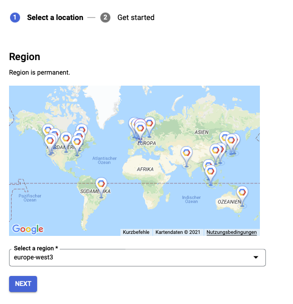

# App Engine

App Engine is Googles fully-managed serverless platform [](https://cloud.google.com/appengine/). It comes with
2 variants which is AppEngine standard environment and App Engine flexible environment. A comparison can be found
[here](https://cloud.google.com/appengine/docs/the-appengine-environments).

## Creating an application

You'll have to enable the AppEngine API first. This can be done via the UI by visiting the UI or via a dedicated API.

Before you can deploy a different service for AppEngine flexible or standard you have to create an application first. You
can only create one application per project. This application can then consist of multiple different services which will
serve e.g. different subpaths or domains of the application. Every service can then decide whether it will run on the
flexible or standard environment. This means that you can run services that have a pretty predictable or constant load
and don't need to scale within seconds to handle peaks in the flexible environment, and services that have the need
to scale within seconds with the standard environment.



Once this step is completed you are able to deploy differrent services in AppEngine.

## Deploying services

I decided to first deploy a default service and then 2 different services, one with App Engine flex, one with
the standard environment. I started with the default and and the flexible.

### App Engine Flexible

With the flexible environment App Engine will run any Docker containers on Google Compute Engine. With that in mind is
not really "serverless" since you will always see the VMs in Compute Engine. Also the startup times mentioned with "minutes"
is not really meant for super flexible scaling applications. The interesting part here is how much you have to "manage"
the underlying Compute Engine VMs in comparison also to Managed Instances.
For more in-depth documentation look at [App Engine Flexible](./flexible).

### App Engine Standard

With the standard environment you can just run specific language code without having to manage any server or anything else.
For more in-depth documentation look at [App Engine Standard](./standard).

## Make it available under a Global HTTPS LoadBalancer

Since the created URLs for AppEngine services looks pretty strange (e.g. [](https://senacor-cloud-hackathon2021.ey.r.appspot.com/gcp)),
I want to make it accessible under e.g. `hackathon.senacor.sebastianneb.de` and route specific subpaths to specific
AppEngine services. This would enable a later switch from standard to flexible and vice versa much easier. Also a
switch to a different platform like CloudRun oder CloudFunctions is possible.

I tried out the new Global external HTTPS LoadBalancer that is currently in preview. The only downside is, that a later
switch to Kubernetes is not possible. Nevertheless it is in preview and just great for such an hackathon.
Following the guide [](https://cloud.google.com/load-balancing/docs/https/setting-up-https-serverless#configure_permissions)
I created a External HTTPS LoadBalancer and for the time being forwarded everything to the flexible AppEngine.
The configuration for the host "hackathon.senacor.sebastianneb.de" looked the following:

```yaml
defaultService: projects/senacor-cloud-hackathon2021/global/backendServices/hackathon-app-engine-standard
name: hackathon-appengine
routeRules:
  - matchRules:
      - prefixMatch: /flexible
    priority: 1
    routeAction:
      weightedBackendServices:
        - backendService: projects/senacor-cloud-hackathon2021/global/backendServices/hackathon-app-engine-flexible
          weight: 100
      urlRewrite:
        pathPrefixRewrite: /gcp
  - matchRules:
      - prefixMatch: /standard
    priority: 2
    routeAction:
      weightedBackendServices:
        - backendService: projects/senacor-cloud-hackathon2021/global/backendServices/hackathon-app-engine-standard
          weight: 100
      urlRewrite:
        pathPrefixRewrite: /gcp
  - matchRules:
      - prefixMatch: /
    priority: 3
    routeAction:
      weightedBackendServices:
        - backendService: projects/senacor-cloud-hackathon2021/global/backendServices/hackathon-app-engine-standard
          weight: 50
        - backendService: projects/senacor-cloud-hackathon2021/global/backendServices/hackathon-app-engine-flexible
          weight: 50
      urlRewrite:
        pathPrefixRewrite: /gcp
```
