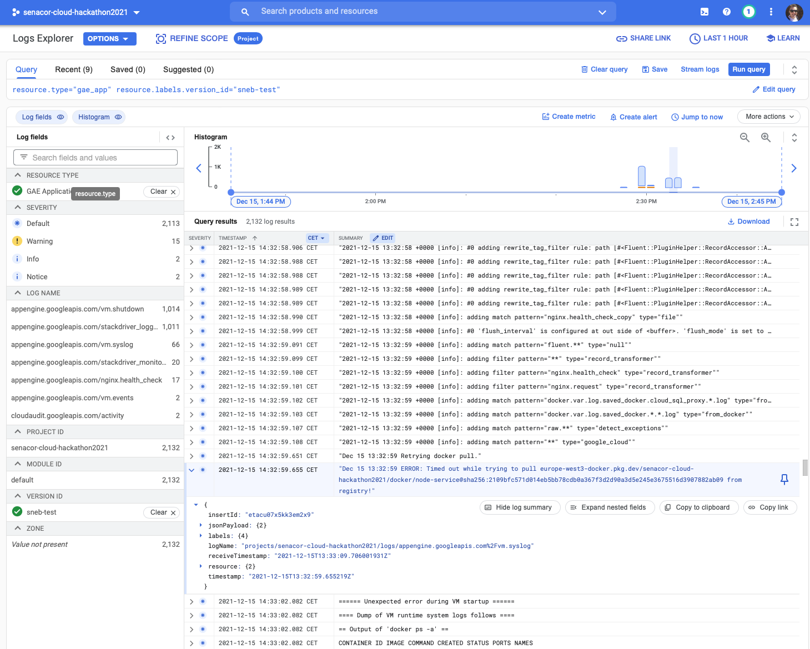

# App Engine Flexible

Since AppEngine flexible totally relies on Docker images, we used the pushed image for the simple node service.

## Deployment

### Docker image

You can either let the command `gcloud app deploy` automatically build your container image with CloudBuild,
or you can prebuild the container image, push it to a registry and use that for App Engine flexible by handing in the
`--image-url` flag. I decided to do the later in order to have more control about the container image. See
[App Enngine Flexible Deoployment Guide](https://cloud.google.com/appengine/docs/flexible/dotnet/testing-and-deploying-your-app?hl=en_US).

In order to deploy a new service you'll need a Docker image first for the flex environment. I used the one originating
from [Service Backend](https://github.com/senacor-hackathon-cloud-2021/service-backend) which is available in the
[public dockerhub](https://hub.docker.com/repository/docker/sebastianneb/senacor-hackathon-node-service). So the image
I used was `sebastianneb/senacor-hackathon-node-service:v0.0.1`.

### TL;DR; Deployment

- You'll need to deploy a "default" service first, before you can deploy other services.
- The `--image-url` flag must be set when we want to customize the docker container.
- Public registries like dockerhub do not work, we need to configure our own
  Google container registry or Artifact registry.
- Either use the default network or create an appropriate VPC with a subnet for AppEngine flex. If using a custom VPC
  make sure to enable a firewall rule to allow traffic to those containers.
- Liveness and Readiness should be defined for faster startup times.
- Error messages and erroes why it couldn't be created are very bad.
- Deployment done via `gcloud app deploy default.app.yaml --version 1 --image-url=europe-docker.pkg.dev/sebastianneb/senacor-hackathon-node-service:v0.0.1`

### Detailed Deployment history and caveats via app.yaml

The deployment itself is described in the [app.yaml](app.yaml) file, which is AppEngines way of configuring a service. The
documentation for this configuration yaml can be accessed [here](https://cloud.google.com/appengine/docs/flexible/nodejs/reference/app-yaml).
The deployment itself is triggered with the command `gcloud app deploy app.yaml --version 1 --image-url=sebastianneb/senacor-hackathon-node-service:v0.0.1`.
The command has to be executed in the directory where the `app.yaml` is located.

I also created a separate service account for this specific service (the default one and the test one)

While doing this the first time thwe following error occurred:

```bash
ERROR: (gcloud.app.deploy) sebastianneb/senacor-hackathon-node-service:v0.0.1 is not in a supported registry.  Supported
registries are ['gcr.io', 'us.gcr.io', 'eu.gcr.io', 'asia.gcr.io', 'staging-k8s.gcr.io', 'marketplace.gcr.io',
'northamerica-northeast1-docker.pkg.dev', 'northamerica-northeast2-docker.pkg.dev', 'us-central1-docker.pkg.dev',
'us-east1-docker.pkg.dev', 'us-east4-docker.pkg.dev', 'us-west2-docker.pkg.dev', 'us-west1-docker.pkg.dev',
'us-west3-docker.pkg.dev', 'us-west4-docker.pkg.dev', 'southamerica-east1-docker.pkg.dev', 'southamerica-west1-docker.pkg.dev',
'europe-central2-docker.pkg.dev', 'europe-north1-docker.pkg.dev', 'europe-west1-docker.pkg.dev', 'europe-west2-docker.pkg.dev',
'europe-west3-docker.pkg.dev', 'europe-west4-docker.pkg.dev', 'europe-west5-docker.pkg.dev', 'europe-west6-docker.pkg.dev',
'asia-east1-docker.pkg.dev', 'asia-east2-docker.pkg.dev', 'asia-northeast1-docker.pkg.dev', 'asia-northeast2-docker.pkg.dev',
'asia-northeast3-docker.pkg.dev', 'asia-south1-docker.pkg.dev', 'asia-south2-docker.pkg.dev', 'asia-southeast2-docker.pkg.dev',
'asia-southeast1-docker.pkg.dev', 'australia-southeast1-docker.pkg.dev', 'australia-southeast2-docker.pkg.dev', 'asia-docker.pkg.dev',
'europe-docker.pkg.dev', 'us-docker.pkg.dev', 'marketplace.gcr.io', 'l.gcr.io', 'launcher.gcr.io', 'us-mirror.gcr.io',
'eu-mirror.gcr.io', 'asia-mirror.gcr.io', 'mirror.gcr.io', 'k8s.gcr.io']
```

After I switched this to `gcloud app deploy app.yaml --version 1 --image-url=europe-docker.pkg.dev/sebastianneb/senacor-hackathon-node-service:v0.0.1`,
I got the following error:

```bash
> gcloud app deploy app.yaml --version 1 --image-url=europe-docker.pkg.dev/sebastianneb/senacor-hackathon-node-service:v0.0.1
Services to deploy:

descriptor:                  [/Users/sneb/Developer/Senacor/hackathon-2021/gcp/appEngine/flexible/app.yaml]
source:                      [/Users/sneb/Developer/Senacor/hackathon-2021/gcp/appEngine/flexible]
target project:              [senacor-cloud-hackathon2021]
target service:              [test]
target version:              [1]
target url:                  [https://test-dot-senacor-cloud-hackathon2021.ey.r.appspot.com]
target service account:      [appengine-test-service@senacor-cloud-hackathon2021.iam.gserviceaccount.com]


Do you want to continue (Y/n)?  y

Enabling service [appengineflex.googleapis.com] on project [senacor-cloud-hackathon2021]...
Operation "operations/acf.p2-282086494199-d96590cb-2217-41a7-b92e-778cca073de1" finished successfully.
Beginning deployment of service [test]...
WARNING: Deployment of service [test] will ignore the skip_files field in the configuration file, because the image has
already been built.
ERROR: (gcloud.app.deploy) INVALID_ARGUMENT: The first service (module) you upload to a new application must be the
'default' service (module). Please upload a version of the 'default' service (module) before uploading a version for
the 'test' service (module). See the documentation for more information.
Python: (https://developers.google.com/appengine/docs/python/modules/#Python_Uploading%%20modules) Java: (https://developers.google.com/appengine/docs/java/modules/#Java_Uploading%%20modules)
```

### Default service

Therefore AppEngine needs a [default service](./default.app.yaml) first... So deploying this AppEngine service as default
service first by `gcloud app deploy default.app.yaml --version 1 --image-url=europe-docker.pkg.dev/sebastianneb/senacor-hackathon-node-service:v0.0.1`.
Next error was:

```bash
gcloud app deploy default.app.yaml --version 1 --image-url=europe-docker.pkg.dev/sebastianneb/senacor-hackathon-node-service:v0.0.1
Services to deploy:

descriptor:                  [/Users/sneb/Developer/Senacor/hackathon-2021/gcp/appEngine/flexible/default.app.yaml]
source:                      [/Users/sneb/Developer/Senacor/hackathon-2021/gcp/appEngine/flexible]
target project:              [senacor-cloud-hackathon2021]
target service:              [default]
target version:              [1]
target url:                  [https://senacor-cloud-hackathon2021.ey.r.appspot.com]
target service account:      [appengine-test-service@senacor-cloud-hackathon2021.iam.gserviceaccount.com]


Do you want to continue (Y/n)?  y

Beginning deployment of service [default]...
WARNING: Deployment of service [default] will ignore the skip_files field in the configuration file, because the image
has already been built.
Updating service [default] (this may take several minutes)...failed.
ERROR: (gcloud.app.deploy) Error Response: [7] The App Engine appspot and App Engine flexible environment service accounts
must have permissions on the image [europe-docker.pkg.dev/sebastianneb/senacor-hackathon-node-service:v0.0.1].
Please check that the App Engine default service account has the [Storage Object Viewer] role and the App Engine
Flexible service account has the App Engine Flexible Environment Service Agent role.
```

I forgot to add the role `App Engine flexible environment Service Agent` and some others since User managed service accounts
are currently a beta feature
[Using user-managed service accounts](https://cloud.google.com/appengine/docs/flexible/nodejs/user-managed-service-accounts#creating_a_user-managed_service_account).
Since I really want to have my own service account for fine grained access control to other google services I decided to
grant the service account the necessary roles and tried again... Sadly it failed with the same error (even though it now
has read access to all GCS buckets within the project). I also tried it with the default app engine service account,
so not using the manual one, but that failed as well with the same error.
Therefore decided to quickly setup a GCR registry and push my image there. I ended up with quickly configuring
[Artifact Registry](https://cloud.google.com/artifact-registry) and granting the custom service account read rights on this
registry.

After I successfully pushed the image to Artifact storage in the path `europe-west3-docker.pkg.dev/senacor-cloud-hackathon2021/docker/node-service`
I tried deploying again with the command
`gcloud app deploy default.app.yaml --version 1 --image-url=europe-west3-docker.pkg.dev/senacor-cloud-hackathon2021/docker/node-service:v0.0.1`.
Now it failed with the error

```bash
> gcloud app deploy default.app.yaml --version 1 --image-url=europe-west3-docker.pkg.dev/senacor-cloud-hackathon2021/docker/node-service:v0.0.1
Services to deploy:

descriptor:                  [/Users/sneb/Developer/Senacor/hackathon-2021/gcp/appEngine/flexible/default.app.yaml]
source:                      [/Users/sneb/Developer/Senacor/hackathon-2021/gcp/appEngine/flexible]
target project:              [senacor-cloud-hackathon2021]
target service:              [default]
target version:              [1]
target url:                  [https://senacor-cloud-hackathon2021.ey.r.appspot.com]
target service account:      [appengine-default-service@senacor-cloud-hackathon2021.iam.gserviceaccount.com]


Do you want to continue (Y/n)?  y

Beginning deployment of service [default]...
WARNING: Deployment of service [default] will ignore the skip_files field in the configuration file, because the image
has already been built.
Updating service [default] (this may take several minutes)...failed.
ERROR: (gcloud.app.deploy) Error Response: [3] Flex operation
projects/senacor-cloud-hackathon2021/regions/europe-west3/operations/b3413dcd-2c4a-483e-b270-bdd755d50bae
error [INVALID_ARGUMENT]: An internal error occurred while processing task
/app-engine-flex/insert_flex_deployment/flex_create_resources>2021-12-15T11:24:57.515Z14036.fs.0: Network 'default'
does not exist
```

which is expected since I deleted the default network on project creation (google best practice).
I had a long time debugging everything. In the end the error was missing permissions to access the docker image
in Artifact Registry... Sadly you won't really get a nice and handy error, but you have to search in the logs of the
started VM, that it can't pull the image...



The final default service in version 0 was deployed with the command:
`gcloud app deploy default.app.yaml --version 0 --image-url=europe-west3-docker.pkg.dev/senacor-cloud-hackathon2021/docker/node-service:v0.1.0`.

### Flexible service

After a default service was running, I wanted to deploy the exact same container with a different set of configuration.
Therefore I created the file [](./flexible.app.yaml). This contains the flexible service. Deployed by using
`gcloud app deploy flexible.app.yaml --version 0 --image-url=europe-west3-docker.pkg.dev/senacor-cloud-hackathon2021/docker/node-service:v0.1.0`
