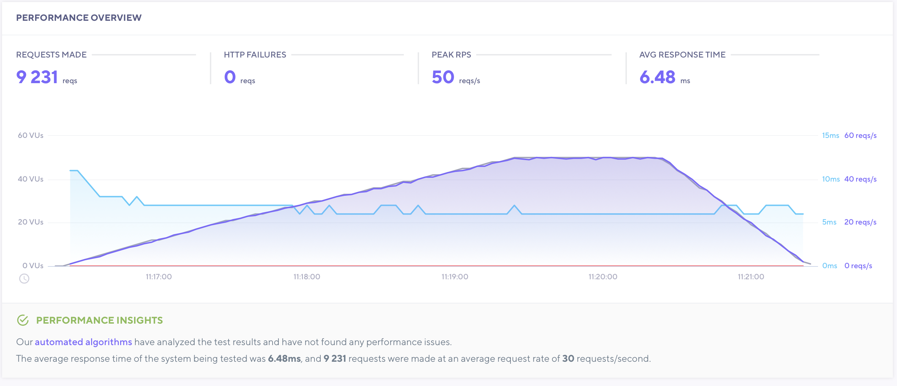
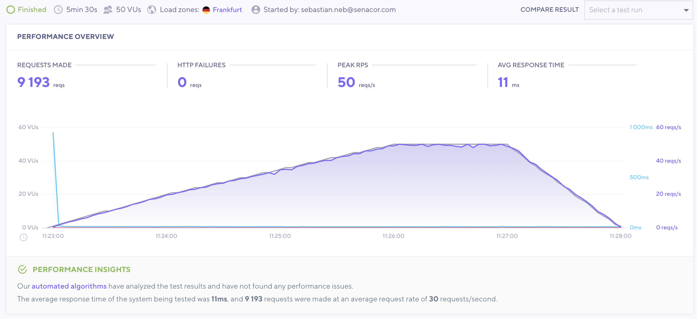
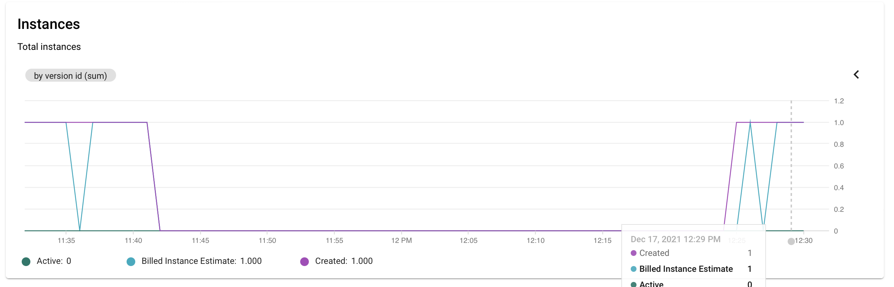
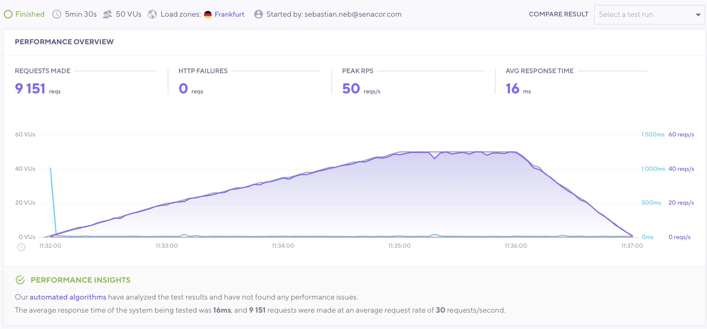
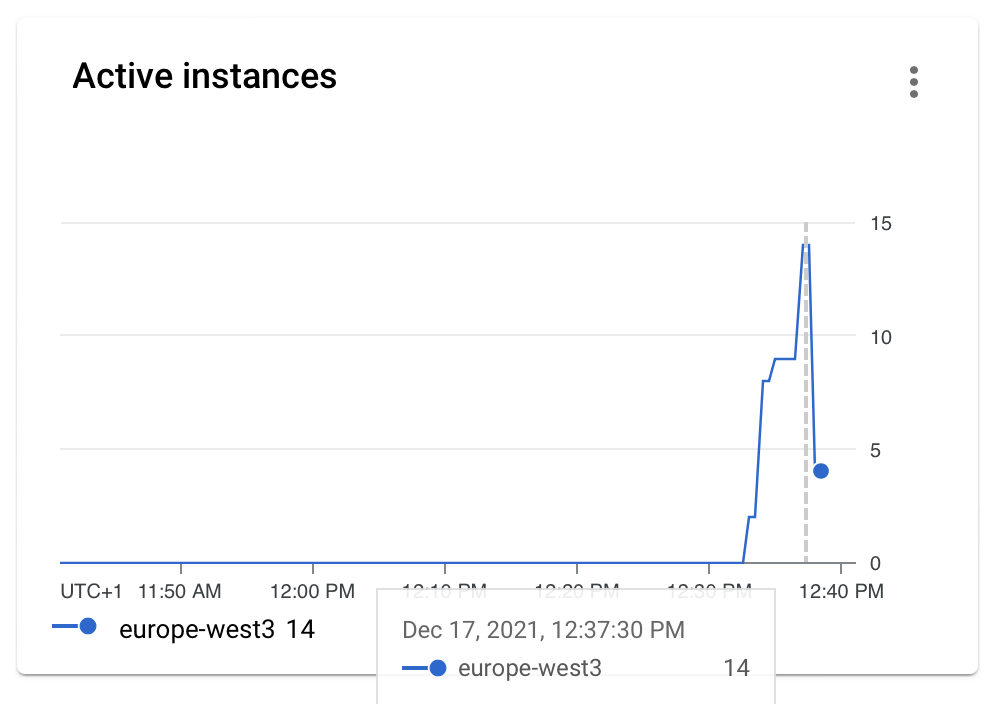
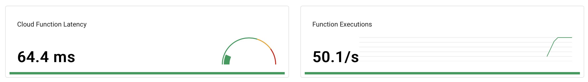
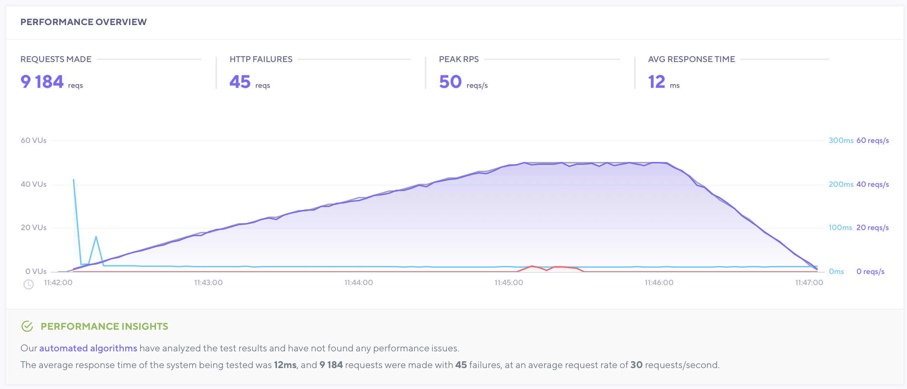
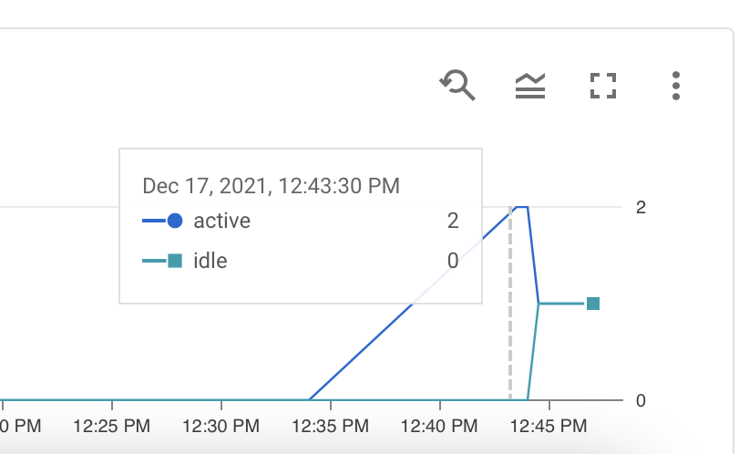

# Load tests

I did run some load tests with k6.

## Flexible

I wasn't able with the free subscription to put enough load on the service so that it
actually scales up. The service was directly reacting to load.

## Standard

The same holds up for the standard one. The only difference was that the very initial call
took the startup time of 1s. After that the service was super fast in responding and only
needed 1 instance for the whole load.

## Cloud Function

As expected Cloud functions scale as good as the standard one, same bahaviour, it needed a little startup
time for the first call. It actually scaled up to 14 parallel instances.

## Cloud Run

Cloud Run is in the end compareable with App Engine Flexible.

