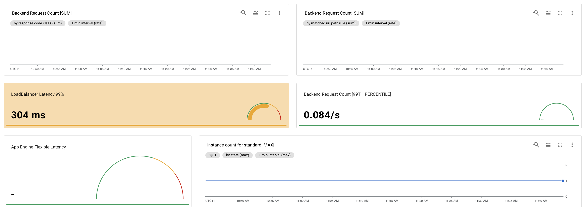
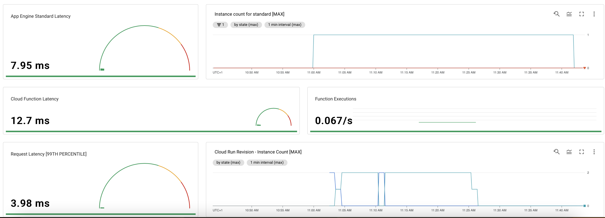

# Monitoring

There are really a lot of already pre-build Dashboards for each service to get a feeling
about the service. I tried to create my own with some meaningful metrics, this already took
some time, since there are really a lot of metrics built-in. I came up with a dashboard
that had the request latency split up to the different services and one overall.
The source code can be accessed [here](./hackathon-monitoring.json).

Based on those dashboards, some meaningful alerts can be implemented.

The dashboard can be accessed [here](<https://console.cloud.google.com/monitoring/dashboards/builder/3a4c3f8a-d23d-4715-bd84-431b95837ccd?project=senacor-cloud-hackathon2021&pageState=(%22interval%22:())&dashboardBuilderState=%257B%2522editModeEnabled%2522:false%257D&timeDomain=1h>)
